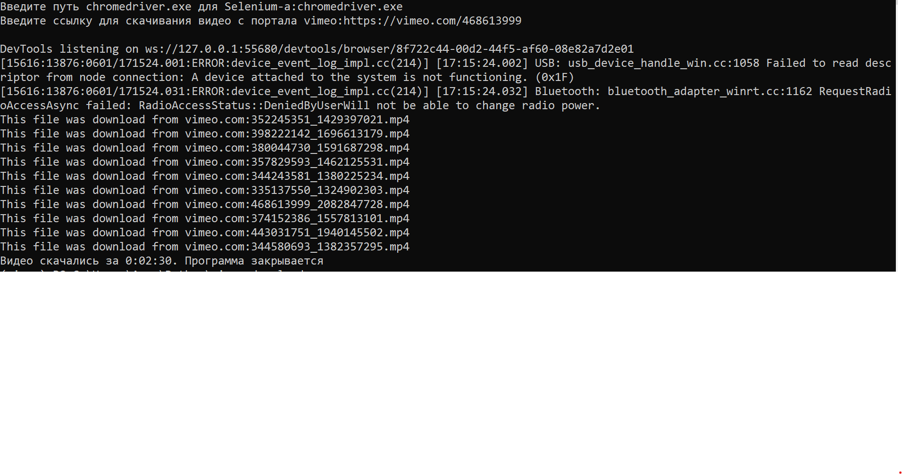

<h1>Программа для скачивания видео по ссылке</h1>

Эта программа скачивает видео по ссылке в vimeo и также все рекомендованные

Для того чтобы установить и воспользоваться программой надо:

<ol>
   <li><code>conda create -n <название_среды> python=<версия_python></code> или установите virtualvenv</li>
   <li>Активируйте среду conda:<code>conda activate</code></li>
   <li><code>pip install -r requirements.txt</code></li>
   <li>Скачайте также chromedriver для Selenium:<a href="https://chromedriver.chromium.org/downloads">chromedriver download</a></li>
   <li>Запустите:<code>python main.py</code></li>
</ol>

Пример работы:
 

Удачного использования!

